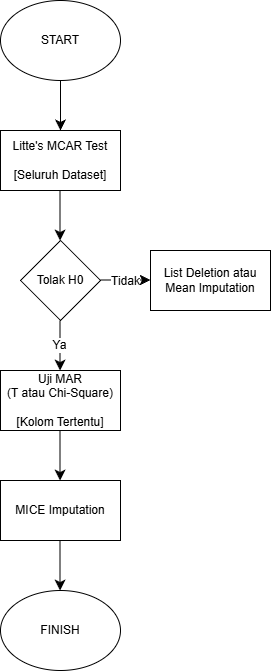

# Import Dependencies

```{r}
library(MASS)
library(naniar)
library(lubridate)
library(tidyverse)
library(mice)
```

```{r}
show_unique <- function(data, col) {
  cat("\nUnique values of", col, ":\n")
  print(unique(data[[col]]))
}

investigasi_mar <- function(data, col_target, alpha=0.05) {
  # Buat indikator target (TRUE jika hilang, FALSE jika ada)
  target_is_missing <- is.na(data[[col_target]])
  
  # Cek apakah target punya missing value? Kalau tidak, stop.
  if (sum(target_is_missing) == 0) {
    stop("Kolom target tidak memiliki missing value!")
  }
  
  print(paste("=== Investigasi MAR untuk", col_target, "==="))
  
  # Ambil semua kolom lain
  fitur_lain <- setdiff(names(data), col_target)
  
  for (f in fitur_lain) {
    
    # --- HUBUNGAN NILAI (VALUE) ---
    if (is.numeric(data[[f]])) {
      try({
        test_val <- t.test(data[[f]] ~ target_is_missing)
        if (test_val$p.value < alpha) {
          print(paste("[VALUE] Numerik:", f, "mempengaruhi hilangnya", col_target, "(p =", format.pval(test_val$p.value), ")"))
        }
      }, silent = TRUE)
      
    } else {
      try({
        test_val <- chisq.test(table(data[[f]], target_is_missing))
        if (test_val$p.value < alpha) {
          print(paste("[VALUE] Kategori:", f, "mempengaruhi hilangnya", col_target, "(p =", format.pval(test_val$p.value), ")"))
        }
      }, silent = TRUE)
    }
    
    # --- HUBUNGAN POLA (PATTERN) ---
    if (any(is.na(data[[f]]))) {
      f_is_missing <- is.na(data[[f]])
      try({
        test_pat <- chisq.test(table(f_is_missing, target_is_missing))
        if (test_pat$p.value < alpha) {
          print(paste("[PATTERN] Pola hilang:", f, "berkaitan dengan hilangnya", col_target, "(p =", format.pval(test_pat$p.value), ")"))
        }
      }, silent = TRUE)
    }
  }
}
```


# Membaca Data

```{r}
data.cafe <- read.csv("Cafe Sales.csv", header = TRUE)
head(data.cafe)
```

```{r}
# Struktur data
str(data.cafe)
```

# Menyiapkan Data

Cek *unique value* dari setiap kolom.

```{r}
cols <- c(
  "Item",
  "Quantity",
  "Price.Per.Unit",
  "Total.Spent",
  "Payment.Method",
  "Location",
  "Transaction.Date"
)

purrr::walk(cols, show_unique, data = data.cafe)
```

```{r}
data.cafe <- data.cafe %>%
  # Ganti semua error menjadi NA di semua kolom
  mutate(across(everything(),
                ~ replace(., . %in% c("ERROR", "UNKNOWN", ""), NA))) %>%
  
  # Ubah tipe datanya
  mutate(
    # Ubah ke Integer
    Quantity = as.integer(Quantity),
  
    Price.Per.Unit = as.numeric(Price.Per.Unit),
    Total.Spent = as.numeric(Total.Spent),
    
    Transaction.Date = ymd(Transaction.Date),
    
    Item = as.factor(Item),
    Payment.Method = as.factor(Payment.Method),
    Location = as.factor(Location),
    
    Transaction.ID = as.character(Transaction.ID)
  )

head(data.cafe)
```

```{r}
# Struktur data
str(data.cafe)
```

```{r}
# Ringkasan data
summary(data.cafe)
```

# Pengecekkan Data Hilang



```{r}
miss_var_summary(data.cafe)
```

Berdasarkan hasil `miss_var_summary(data.cafe)` di atas, dapat diidentifikasi sebaran data hilang sebagai berikut:
<ul>
  <li> `Location` dan `Payment.Method` memiliki jumlah data hilang yang sangat masif, masing-masing sebesar 39.6% (3.961 baris) dan 31.8% (3.178 baris).
  <li> `Item` memiliki data hilang sebesar 9.69%.
  <li> `Price.Per.Unit`, `Total.Spent`, `Quantity`, dan `Transaction.Date` memiliki tingkat kehilangan data yang relatif rendah dan seragam, berkisar antara 4.6% hingga 5.3%. Sepertinya ini adalah baris-baris yang awalnya berisi teks "ERROR" atau "UNKNOWN".
</ul>

## MCAR

```{r}
mcar_test(data.cafe)
```

Untuk memvalidasi mekanisme kehilangan data, dilakukan uji *Little's MCAR Test* dengan hipotesis sebagai berikut:
<ul>
  <li> $H_0$: Data hilang bersifat *Missing Completely at Random* (MCAR).
  <li> $H_1$: Data hilang tidak bersifat MCAR. 
</ul>

Karena *p-value* > 0.05, maka **Gagal Tolak $H_0$**.
Dengan tingkat kepercayaan 95%, belum cukup bukti untuk menyatakan bahwa pola kehilangan data bersifat sistematis. Dengan kata lain, data yang hilang pada dataset ini diasumsikan bersifat MCAR.

Jika ingin mempelajari *Little's MCAR Test* lebih lanjut.

[A Test of Missing Completely at Random for Multivariate Data with Missing Values](https://doi.org/10.2307/2290157)

## MAR

```{r}
# Misalnya kita fokus ke kolom Location
investigasi_mar(data.cafe[, -c(1)], "Location")
```

Meskipun uji Little menunjukkan data bersifat MCAR secara global, dilakukan pemeriksaan lebih spesifik untuk memastikan hubungan antara hilangnya data `Location` dengan peubah lainnya. Hasil investigasi spesifik menunjukkan hilangnya data `Location` memiliki hubungan signifikan ($p < 0.05$) dengan peubah `Item`, yang mengindikasikan adanya mekanisme *Missing at Random* (MAR) pada peubah tersebut.

# Penanganan Data Hilang dengan Teknik Sederhana

## Penghapusan Kasus (Listwise or Case Deletion)

Gunakan code berikut ini kalau memang data hilang ditemukan memiliki mekanisme MCAR saja.

```{r}
data.hilang <- data.cafe[!complete.cases(data.cafe), ]
head(data.hilang)
```

```{r}
data.lengkap1 <- na.omit(data.cafe)
head(data.lengkap1)
```

## Penggantian dengan Rataan (*Mean Substitution*)

Gunakan code berikut ini kalau memang data hilang ditemukan memiliki mekanisme MCAR atau MAR.

```{r}
rataan.qty <- median(data.cafe$Quantity, na.rm = TRUE)
rataan.qty
```

```{r}
data.lengkap2 <- data.cafe
data.lengkap2$Quantity <- ifelse(is.na(data.lengkap2$Quantity), rataan.qty, data.lengkap2$Quantity)
head(data.lengkap2)
```

## Pengisian dengan MICE (MICE *Imputation*)

Disarankan menggunakan code berikut ini saat ditemukan mekanisme data hilang MAR.

```{r}
data.lengkap3 <- data.cafe
data.lengkap3$Transaction.Date <- as.numeric(data.lengkap3$Transaction.Date)
head(data.lengkap3)
```

Sebelum melakukan proses imputasi, dilakukan pra-pemrosesan pada peubah `Transaction.Date`. Peubah ini dikonversi sementara dari format tanggal (*Date*) menjadi format numerik untuk memungkinkan algoritma MICE melakukan perhitungan matematis (regresi) pada data waktu tersebut.

```{r}
mice_method.cafe <- mice(data.lengkap3, maxit = 0)$method # maxit = 0 artinya jangan dihitung dulu
print(mice_method.cafe)
```

Selanjutnya, dilakukan proses inisialisasi (*dry run*) dengan parameter `maxit = 0`. Langkah ini bertujuan untuk mengevaluasi metode imputasi yang dipilih secara otomatis oleh algoritma MICE berdasarkan tipe data masing-masing peubah, tanpa melakukan iterasi perhitungan.

Berdasarkan hasil dry run di atas, berikut adalah spesifikasi metode yang akan digunakan:
<ol>
  <li> Peubah Numerik (`Quantity`, `Price.Per.Unit`, `Total.Spent`, `Transaction.Date`)
       *Predictive Mean Matching* (`pmm`) ini dipilih karena peubah bertipe numerik/kontinu. PMM sangat robust karena mengisi missing value dengan mengambil nilai asli dari observasi lain yang memiliki kemiripan (donor), sehingga menjamin hasil imputasi tetap masuk akal (misalnya, tidak akan menghasilkan nilai negatif atau desimal yang tidak realistis).
  <li> Peubah Kategorik Nominal > 2 Level (`Item`, `Payment.Method`)
       Peubah ini memiliki lebih dari dua kategori yang tidak berjenjang (*multiclass*). *Polytomous Regression* (`polyreg`) ini menggunakan regresi multinomial untuk memprediksi probabilitas setiap kategori.
  <li> Peubah Kategorik Biner (`Location`)
       Peubah ini terdeteksi hanya memiliki dua kategori. *Logistic Regression* (`logreg`) adalah standar terbaik untuk imputasi data biner.
  <li> Peubah Identifier (`Transaction.ID`)
       Algoritma secara otomatis mendeteksi bahwa kolom ini adalah *unique identifier* (ID) yang tidak memiliki nilai prediktif, sehingga dikeluarkan dari model imputasi untuk menjaga efisiensi.
</ol>

```{r}
hasil_imputasi <- mice(data.lengkap3, method = mice_method.cafe, m = 5, seed = 75) # m = 5 artinya kita membuat 5 versi data
data.lengkap3 <- complete(hasil_imputasi, 1) # ambil hasil imputasi ke-1

data.lengkap3$Transaction.Date <- as.Date(data.lengkap3$Transaction.Date,
                                          origin = "1970-01-01")

head(data.lengkap3)
```

Jika ingin mempelajari MICE *Imputation* lebih lanjut.

```{r}
citation("mice")
```

# Pengecekkan Pencilan (*Outlier*)

```{r}
data.rumah <- read.csv("House Prices.csv", header = TRUE)
head(data.rumah)
```

## Pencilan Univariat

```{r}
boxplot(data.rumah$SalePrice, 
        main = "Boxplot of Sale Price", 
        ylab = "Price ($)", 
        col = "coral")
```

Berdasarkan visualisasi menggunakan *Boxplot of Sale Price*, terlihat adanya sejumlah pengamatan yang terletak jauh di atas *whisker* bagian atas. Titik-titik lingkaran tersebut mengindikasikan adanya rumah dengan harga jual yang sangat tinggi dibandingkan mayoritas data dalam populasi tersebut.

```{r}
Q1.salePrice <- quantile(data.rumah$SalePrice, 0.25)
Q3.salePrice <- quantile(data.rumah$SalePrice, 0.75)
IQR.salePrice <- Q3.salePrice - Q1.salePrice

batas.bawah.salePrice <- Q1.salePrice - 1.5 * IQR.salePrice
batas.atas.salePrice <- Q3.salePrice + 1.5 * IQR.salePrice

print(paste("Batas Bawah Pencilan:", batas.bawah.salePrice))
print(paste("Batas Atas Pencilan:", batas.atas.salePrice))
```

```{r}
pencilan_univariat <- data.rumah$SalePrice[data.rumah$SalePrice < batas.bawah.salePrice | data.rumah$SalePrice > batas.atas.salePrice]
length(pencilan_univariat)
```

Setelah dilakukan pemfilteran, teridentifikasi sebanyak 61 pencilan univariat pada peubah `SalePrice`.

## Pencilan dalam Regresi Linear

```{r}
model.rumah <- lm(SalePrice ~ GrLivArea, data = data.rumah)
summary(model.rumah)
```

Berdasarkan ringkasan model model.rumah, peubah `GrLivArea` memiliki pengaruh yang signifikan terhadap `SalePrice` ($p-value < 2 \times 10^{-16}$) dengan nilai koefisien determinasi ($R^2$) sebesar 0.5021. Hal ini menunjukkan bahwa sekitar 50.21% keragaman harga rumah dapat dijelaskan oleh luas area ruang tamu melalui model ini.

```{r}
res_student <- rstudent(model.rumah)
pencilan_regresi <- which(abs(res_student) > 3)
print(paste("Jumlah pencilan dalam regresi:", length(pencilan_regresi)))
```

```{r}
par(mfrow = c(1, 2))

# Plot Sisaan (Residual Plot)
plot(predict(model.rumah), resid(model.rumah), 
     main = "Residual Plot", 
     xlab = "Fitted Values", 
     ylab = "Residuals")
abline(h = 0, lty = 2, col = "purple")

# Plot Studentized Residual
plot(predict(model.rumah), res_student, 
     main = "Studentized Residuals", 
     xlab = "Fitted Values", 
     ylab = "Studentized Residuals")
abline(h = c(-3, 3), lty = 2, col = "purple")
```

Untuk mendeteksi pengamatan yang tidak mampu dijelaskan dengan baik oleh model, dilakukan analisis sisaan (*residual analysis*):
<ul>
  <li> `*Residual Plot*`: Visualisasi menunjukkan beberapa titik yang menyimpang jauh dari garis horizontal nol, mengindikasikan adanya sisaan yang besar pada pengamatan tertentu.
  <li> `*Studentized Residuals*`: Berdasarkan kriteria, pengamatan diidentifikasi sebagai pencilan jika nilai mutlak *studentized residual* lebih besar dari 3 ($|t_i| > 3$).
  <li> Ditemukan sebanyak 27 pencilan dalam regresi yang berada di luar ambang batas $[-3, 3]$.
</ul>

# Transformasi Data

```{r}
set.seed(75)
pendapatan <- rchisq(100, 3)
x <- pendapatan
```


Cek bentuk histogram dari data.

```{r}
hist(pendapatan, breaks=30, freq=F)
curve(dchisq(x, 3), lty=2, col="coral", lwd=3, add=T)
```

Cek Q-Q Plot

```{r}
qqnorm(x, pch=1, frame=F)
qqline(x, col="purple", lwd=2)
```

## Transformasi ln(X)

Dapat dicobakan transformasi ln(X) atau sqrt(X)

```{r}
trans1 <- log(pendapatan)
x <- trans1

hist(trans1, breaks=30, freq=F)
curve(dnorm(x, mean(x), sd(x)), lty=2, col="coral", lwd=3, add=T)
```

```{r}
qqnorm(x, pch=1, frame=F)
qqline(x, col="purple", lwd=2)
```

## Transformasi sqrt(X)

```{r}
trans2 <- sqrt(pendapatan)
x <- trans2

hist(trans2, breaks=30, freq=F)
curve(dnorm(x, mean(x), sd(x)), lty=2, col="coral", lwd=3, add=T)
```

```{r}
qqnorm(x, pch=1, frame=F)
qqline(x, col="purple", lwd=2)
```

## Metode Box-Cox

```{r}
bb <- boxcox(lm(pendapatan~1))
```

```{r}
lambda <- bb$x[which.max(bb$y)]
lambda
```

Berdasarkan plot log-likelihood yang dihasilkan, nilai $\lambda$ optimal ditemukan sebesar 0.2626263. Nilai ini berada di antara 0 (transformasi logaritma) dan 0.5 (transformasi akar kuadrat), yang secara spesifik digunakan untuk menormalkan data yang memiliki kemiringan tertentu. 

```{r}
trans3 <- pendapatan^(lambda)
x <- trans3

hist(trans3, breaks=30, freq=F)
curve(dnorm(x, mean(x), sd(x)), lty=2, col="coral", lwd=3, add=T)
```

```{r}
qqnorm(x, pch=1, frame=F)
qqline(x, col="purple", lwd=2)
```

Setelah nilai $\lambda$ optimal diterapkan pada data, dilakukan evaluasi ulang terhadap bentuk sebaran data hasil transformasi:
<ul>
  <li> Histogram: Visualisasi menunjukkan bahwa sebaran data kini telah mengikuti kurva normal secara lebih presisi dibandingkan data asli. Distribusi data terlihat lebih simetris dan tidak lagi condong ke satu sisi.
  <li> Normal Q-Q Plot: Titik-titik pengamatan pada plot Q-Q kini hampir seluruhnya berhimpit pada garis referensi diagonal. Hal ini membuktikan bahwa asumsi normalitas telah terpenuhi dengan baik pasca-transformasi.
</ul>

